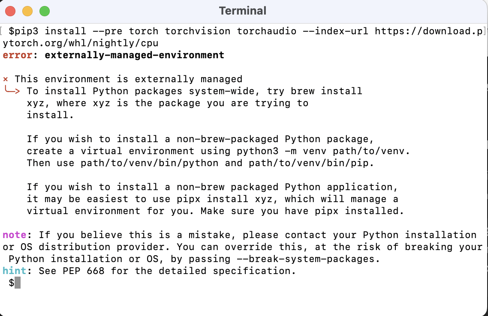

# How to Install ComfyUI for Stable Diffusion on a Mac

This tutorial will guide you through installing ComfyUI and run it locally on your Mac using Ollama. 

## Quick Links
* [Homebrew](https://brew.sh/index)
* [ComfyUI](https://github.com/comfyanonymous/ComfyUI)


## Prerequistes
- To operate ComfyUI, you require an Apple Silicon device, specifically an M1 chip or newer.
- Administrator privileges are required for the installation.
- macOS 12.3 or later


## Installation Steps

### Step 1: Install Homebrew

#### Launch Installation Script
To install [Homebrew](https://brew.sh/index), launch the Terminal app, paste the following command, and then press `Enter`. This command will download and run the Homebrew installation script.

```markdown
/bin/bash -c "$(curl -fsSL https://raw.githubusercontent.com/Homebrew/install/HEAD/install.sh)"
```

The script will prompt you to continue with the installation. **It will ask for your password**, as it needs administrator privileges to install Homebrew. Type your password (you won't see it as you type) and press `Enter`. 

You will then be asked to confirm the installation by hitting `Enter` again.

 The installation process may take a few minutes. It will download and install the necessary files and dependencies.

#### Adjust Path Variable
Once the installation is complete, you should see a message indicating that Homebrew has been successfully installed. 

> You'll also see a "Next Steps" section in your terminal, guiding you to adjust the PATH environment variable to ensure recognition and accessibility of Homebrew commands from any directory in the Terminal. This section provides a customized command containing the path to your user folder on macOS.


Copy the command, paste it into your terminal, and press `Enter`.

#### Verify Installation
To verify the proper installation of Homebrew, enter the following command in the terminal and press `Enter`:

```
brew --version
```

This command will display the version of Homebrew installed on your system, if it's installed. If Homebrew is not installed, you'll typically see an error message indicating that the command was not found.


### Step 2 - Install Python and Pip

You'll need Python and pip to run PyTorch, which will be installed in step 3. Ensure that you have the latest version of Python (currently version 3.12), which already includes pip. 

#### Check Current Python Version
Open your terminal and run the following command to check the current Python version:

   ```bash
   python --version
   ```

   This command will display the current Python version installed on your system.

#### Upgrade Python to the Latest Version using Homebrew

If you have Python installed via Homebrew and you want to upgrade it to the latest version, you can use the following command:

   ```bash
   brew upgrade python
   ```

   This command will upgrade the Python package to the latest version available in Homebrew.

 If you don't have python installed yet, use the following command to install it:

```bash
 brew install python
```

#### Check Python Version After Upgrade
   After upgrading Python, run the following command to verify that it has been upgraded to the latest version:
   ```bash
   python --version
   ```

   This command will display the updated Python version, which should be the latest one you have installed

#### Check if `pip` is Installed
   To check if `pip` is installed, run the following command in your terminal:
   ```bash
   pip --version
   ```

   If `pip` is installed, this command will display its version number. If `pip` is not installed, you'll likely see an error message indicating that the command is not found or not recognized.

   If `pip` is not installed, you can typically install it using your package manager. If you're using Homebrew, you can install `pip` by running:
   ```bash
   brew install pip
   ```

   After installing `pip`, you can verify its installation by running `pip --version` again.

### Step 3 - Install ComfyUI

#### Find the URL for cloning ComfyUI
ComfyUI can be found in a GitHub repository called [ComfyUI](https://github.com/comfyanonymous/ComfyUI) and to install it, you must clone that repository to your local computer. You can do this by copying the URL provided by the repository creators under the green button `code`, which corresponds to the following URL: https://github.com/comfyanonymous/ComfyUI.git


#### Choose Installation Directory for ComfyUI

You have the flexibility to install ComfyUI in any location of your preference. Personally, I have set up a folder named `GitHub` where I store all my GitHub repositories. You can opt to create a separate folder specifically for such installations, although the choice is entirely yours. In case you decide to do so, ensure to navigate to that designated folder in your terminal before cloning the ComfyUI repository.

To access the directory for cloning ComfyUI on your Mac, launch your terminal and input the `cd` command along with the target folder path. Another method to streamline this procedure is by typing `cd` followed by a `space` in the terminal and then dragging and dropping the folder from Finder directly into the terminal window. This action will automatically translate into a folder path, making navigation more convenient. Then, press `Enter` to access the appropriate folder.

```
cd /Users/techxplainator/GitHub 
```

#### Clone ComfyUI

After reaching the correct directory, you can clone the repository by executing the `git clone` command along with the URL supplied by ComfyUI. Alternatively, you can directly copy the command from here for convenience:

```
git clone https://github.com/comfyanonymous/ComfyUI.git
```

The cloning process typically completes within a few seconds, resulting in a folder named ComfyUI appearing in your selected installation directory in Finder. In my case, it appears within the `GitHub` folder.

### Step 4 - Install Requirements

In the newly installed ComfyUI folder, you'll see a file called `requirements.txt` which contains all the requirements ComfyUI needs to run smoothly.

To install these prerequisites, return to the requirements and navigate to the ComfyUI folder by utilizing the `cd` command along with the directory path. Alternatively, input `cd` followed by a `space` and drag the ComfyUI folder from Finder into the terminal application to automatically extract the accurate path. Then, press `Enter` to access the appropriate folder.

Then write:

```
pip3 install -r requirements.txt
```

and hit `Enter` to start installing the requirements.

This process will take several minutes to complete.

## How to run ComfyUI

To run ComfyUI after installation, you'll need to use your terminal app again.

First, ensure you're in the correct directory. This means the ComfyUI directory you cloned in [step 3](#step-3---install-comfyui). You can achieve this by typing `cd` followed by a `space` in the terminal and then entering the directory path. Alternatively, you can open the Finder window, locate the ComfyUI folder, and drag and drop it onto the terminal. The terminal app will automatically extract the folder path, saving you some typing. Hit `Enter`, then you'll be in the right folder.

Next, type the following command to launch ComfyUI:

```
python3 main.py
```

It will take a few minutes, but then you will see the terminal saying: `To see the GUI go to: http://127.0.0.1:8188`. 

Copy and paste this URL into a browser to open ComfyUI

## How to close ComfyUI

To exit ComfyUI, simply closing the browser window isn't sufficient. You must also return to the terminal app and close the Terminal window to terminate the virtual session created for you via Python.

## Troubleshooting

### Error: externally managed environment

In some cases during the installation of requirements, you encounter an error message saying `externally-managed-environment` when you try install the dependencies in [step 4](#step-4---install-requirements). It will look somewhat like this:



Use a virtual environment to manage dependencies for Python projects. You can create one using:

```
python3 -m venv myenv
```

and then activate it with 
```
source myenv/bin/activate
```

Within the virtual enviroment, you may now enter the same command to trigger installation again:

```
pip3 install -r requirements.txt
```
